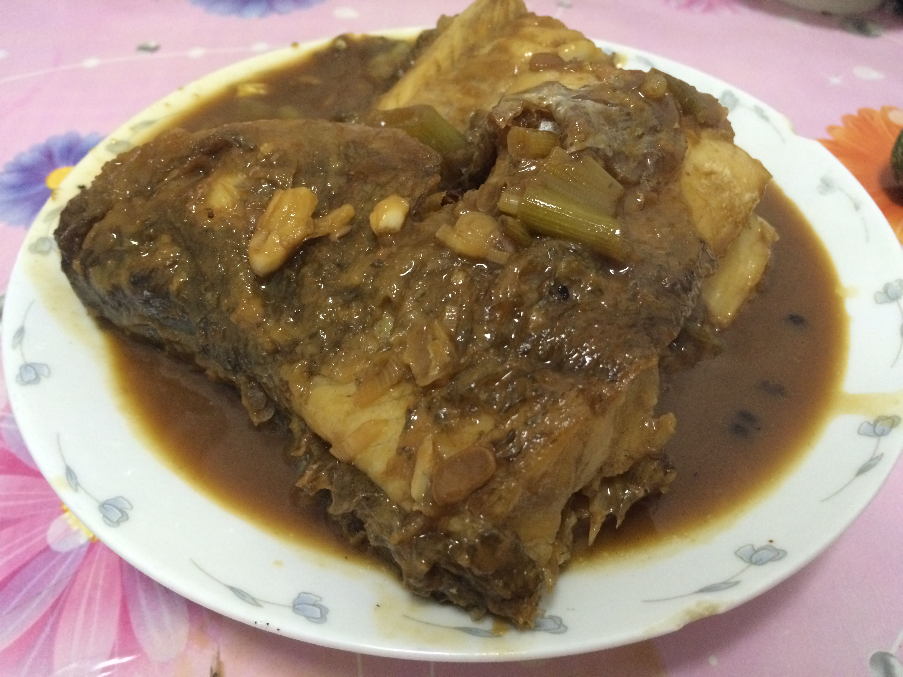

title: 红烧鲈鱼
date: 2015-06-21 22:28:38
categories: 生活
tags: [家常菜,海鲜]
toc: false
---

>连续两天过节，趁着回家的机会要好好学习学习厨艺。自从出道以来，一直没做过鱼，今天在家小试牛刀，老娘手把手教我，于是乎定要把内功心法记录下来

## Step1.基本食材
1. 鲈鱼
2. 葱、姜、蒜、大料、花椒
3. 糖、醋、耗油、酱油、料酒、面或者淀粉

## Step2.开始做菜吧
1. 把鱼洗干净，切好，然后准备好葱姜大蒜少许，放在碗里（调料一）
2. 再准备一个碗用来调料：放少许糖，醋和均匀，然后稍微多倒一些酱油和耗油（调料二）
3. 拿一个碟子，倒上面粉或者淀粉，然后把处理好的鱼放在里面，让其表面粘上面粉即可
4. 开火炝锅，倒些花椒，可以去腥，然后把鱼放在锅里
5. 最好不要频繁的用铲子搅和鱼，容易把鱼皮弄烂
6. 晃悠锅里的油，差不多了就把刚刚准备好的葱姜大蒜（调料一）倒进去
7. 快速用料酒撒锅一圈，然后闷上盖子，料酒可以去腥
8. 轻轻地将鱼翻个身，让两面受热均匀
9. 把刚刚准备好的调料二加一些自来水，倒入锅中，直到锅中的水覆盖过鱼
10. 开大火，盖上盖子，等待收汁吧！
11. 别忘了，时不时的晃悠一下锅，别让锅底的鱼糊了，铲的时候小心一些
12. 如果觉得不够咸，可以放一些盐，不过之前调料二已经很有咸蛋味了

好了，就这么多，期待下一期美食，see you again~
