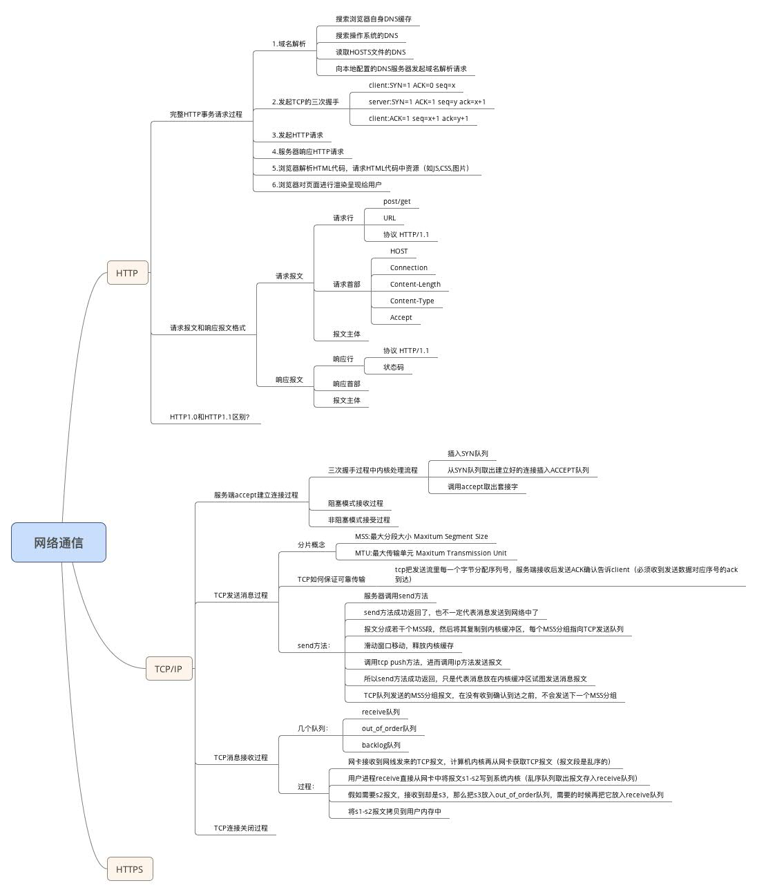

title: 网络通讯
date: 2016-03-01 17:40:47
categories: 技术
tags: [java,网络,通讯]
toc: true
---
#一、网络编程中两个主要的问题

一个是如何准确的定位网络上一台或多台主机，另一个就是找到主机后如何可靠高效的进行数据传输。

在TCP/IP协议中IP层主要负责网络主机的定位，数据传输的路由，由IP地址可以唯一地确定Internet上的一台主机。

而TCP层则提供面向应用的可靠（tcp）的或非可靠（UDP）的数据传输机制，这是网络编程的主要对象，一般不需要关心IP层是如何处理数据的。

目前较为流行的网络编程模型是客户机/服务器（C/S）结构。即通信双方一方作为服务器等待客户提出请求并予以响应。客户则在需要服务时向服务器提 出申请。服务器一般作为守护进程始终运行，监听网络端口，一旦有客户请求，就会启动一个服务进程来响应该客户，同时自己继续监听服务端口，使后来的客户也 能及时得到服务。

<!--more-->

#二、两类传输协议：TCP；UDP

TCP是Tranfer Control Protocol的 简称，是一种面向连接的保证可靠传输的协议。通过TCP协议传输，得到的是一个顺序的无差错的数据流。发送方和接收方的成对的两个socket之间必须建 立连接，以便在TCP协议的基础上进行通信，当一个socket（通常都是server socket）等待建立连接时，另一个socket可以要求进行连接，一旦这两个socket连接起来，它们就可以进行双向数据传输，双方都可以进行发送 或接收操作。

UDP是User Datagram Protocol的简称，是一种无连接的协议，每个数据报都是一个独立的信息，包括完整的源地址或目的地址，它在网络上以任何可能的路径传往目的地，因此能否到达目的地，到达目的地的时间以及内容的正确性都是不能被保证的。

比较：
##UDP:
1. 每个数据报中都给出了完整的地址信息，因此无需要建立发送方和接收方的连接。
2. UDP传输数据时是有大小限制的，每个被传输的数据报必须限定在64KB之内。
3. UDP是一个不可靠的协议，发送方所发送的数据报并不一定以相同的次序到达接收方

##TCP:
1. 面向连接的协议，在socket之间进行数据传输之前必然要建立连接，所以在TCP中需要连接时间。
2. TCP传输数据大小限制，一旦连接建立起来，双方的socket就可以按统一的格式传输大的数据。
3. TCP是一个可靠的协议，它确保接收方完全正确地获取发送方所发送的全部数据。

#三、总结的脑图：

