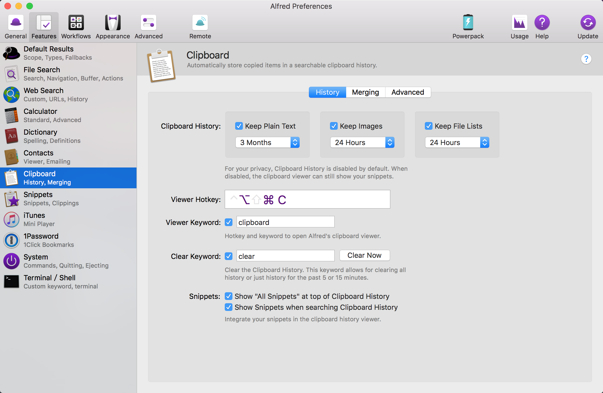
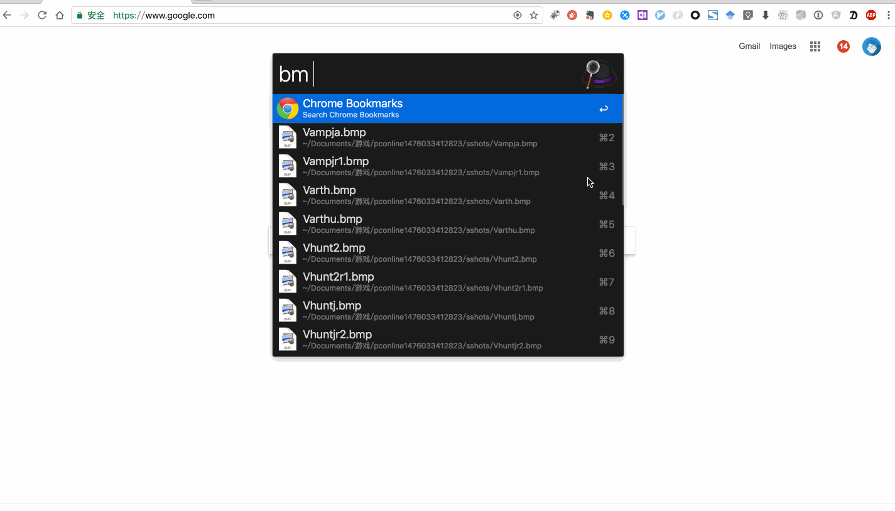

title: 让alfred节省你5天生命
date: 2017-02-21 00:59:42
categories: 技术
tags: [效率]
toc: true
---
# 神兵利器，alfred
> 工欲善其事必先利其器

现如今用mac的用户有很多，大家都知道alfred是mac的神器，好奇心比较重的我，刚接触mac就开始研究这款神器，现如今，在mac上做任何一个操作如果不用alfred真的是很别扭。考虑到这个神器真的对我工作带来很高的效率，于是总结一下平时觉得不错的点分享给大家

## 软件安装
alfred付费的workflow功能十分昂贵，刚开始我心血来潮一冲动就花了17欧元买了官方付费版，后来发现网上能找到破解版，也是欲哭无泪，这里把破解版的共享给大家 [下载](www.baidu.com)

## 提升效率
> 说一下我平时工作都会做哪些事情吧，

1. 复制粘贴（文本、文件、图片）
先设置一下clipboard，我们可以再preferences设置的快捷键是`option+command+c`

让我们复制文本，剪切图片看看效果

2. 打开各种环境地址（日常、预发、线上、弹外）
最近一个多月都在on call，解决用户(集团内部、公有云、专有云)提出来的各种问题，每天真的是高并发啊，一会儿有集团内部用户需要排除日常问题，一会儿又有公有云用户排查弹外环境问题，一会儿又有人需要排查线上问题，这个过程中要访问好几个系统，而且每个系统的domain都不一样，光靠人脑是记不住的，于是查了查alfred能否帮我提升效率，还真有一款workflow：`Chrome Bookmarks`

`注意`这里我可是修改了keyword了哦~原来是`,b`为了方便改成`bm`

3. 文件搜索（半个月前小李发给我的文件怎么找不到了啊...）
4. 查看文档有英文单词不认识
5. 软件退出卡住了，要kill进程
6. 快速获取本机ip
7. 控制音乐播放
